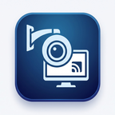

# WeViewCam (Android) - 现代化视频监控综合管理平台

<div align="center">
  
  <h3>专为 Android 移动终端打造的现代化视频监控客户端 (VMS Client)</h3>
  <p>海康威视官方 Android SDK 深度原生集成 • 1/4分屏实时监控 • 8方向云台控制 • 24小时交互式时间轴录像回放</p>
</div>

---

## 📌 项目概述

**WeViewCam Android** 是对应 Ubuntu Linux 桌面版本的移动端原生移植与重构工程。项目完整继承了 Ubuntu 版本的核心业务逻辑与架构设计，适配 Android 平台（支持手机与平板电脑设备），深度融合海康威视官方 Android 原生 SDK（HCNetSDK），提供极致流畅的低延迟监控、实时抓图与录像、高精度 PTZ 云台遥控及 24 小时高精度自绘交互式时间轴录像回放。

### 核心亮点

1. **官方底层 SDK 深度原生集成**：
   - 原生集成海康威视最新版 Android SDK（`HCNetSDK.jar`、`PlayerSDK_hcnetsdk.jar`、`jna.jar`）；
   - 包含完整的 `arm64-v8a`、`armeabi-v7a` 及 `armeabi` 原生动态链接库（`libhcnetsdk.so`、`libPlayCtrl.so`、`libcrypto.so`、`libssl.so` 等 20 组底层库）；
   - 基于原生 `SurfaceView` / `Surface` 句柄硬件加速直传渲染，CPU 占用极低。
2. **多协议适配器架构 (Adapter Pattern)**：
   - 统一抽象 `BaseDeviceAdapter` 接口，屏蔽各厂商底层通信协议差异；
   - 提供 `HikvisionAdapter`（官方底层 SDK 实现）、`OnvifAdapter`（ONVIF/RTSP 国际标准）及高保真 `MockDeviceAdapter`（脱机/模拟演示引擎，便于免硬件调试与功能验收）。
3. **多分屏实时视频监控 (Live View)**：
   - 支持 **单画面 (1x1)** 与 **四分屏 (2x2)** 动态切换；
   - 双击任意视频视口全屏放大，再次双击还原；
   - 视口选中边框高亮（`#58a6ff`）与通道状态 OSD 显示；
   - 主码流 / 子码流一键无缝切换；
   - 实时通道抓图（JPEG 存入相册目录）与本地视频录像（MP4）。
4. **完整 PTZ 云台与镜头控制面板**：
   - 8 方向虚拟罗盘触控（上、下、左、右、左上、右上、左下、右下），支持按下持续旋转、松开即停；
   - 镜头调焦：变倍 (Zoom +/-)、聚焦 (Focus +/-)、光圈 (Iris +/-)；
   - 1~7 级旋转速度无级滑块调节。
5. **24 小时交互式时间轴录像检索与回放 (Playback)**：
   - 按设备、通道、日期精准检索 NVR / IPC 存储的历史录像；
   - 自绘高精度 **24 小时交互式时间轴 (`TimelineBarView`)**：直接移植自 Ubuntu 版本的自绘时间轴算法，绿色高亮普通定时录像区间、橙色高亮报警录像区间；
   - 时间轴无级缩放（24h / 12h / 4h / 1h 四档一键切换）；
   - 拖拽红色时间指示指针实现毫秒级精准定位拖动播放；
   - 完整播控支持：播放/暂停、停止、快进 (2x/4x/8x/16x)、慢放 (1/2x, 1/4x)、单帧步进、回放画面抓图。
6. **设备管理中心 (Device Management)**：
   - 本地轻量化 JSON 持久化存储（`devices.json`）；
   - 设备状态卡片展示（在线/离线、IP/端口、通信协议、通道数）；
   - 一键“测试连接”并自动探测下属模拟与数字 IP 视频通道；
   - 支持动态新增、修改与删除监控设备。

---

## 🏗️ 项目工程结构

```text
WeViewCam_android/
├── app/
│   ├── build.gradle                     # Android 应用构建配置 (SDK 33, Java 8, NDK ABI 过滤)
│   ├── proguard-rules.pro               # ProGuard 混淆规则 (保护 HCNetSDK 与 JNA)
│   ├── libs/                            # 海康官方 Android Java 库
│   │   ├── HCNetSDK.jar                 # 海康网络 SDK 核心包
│   │   ├── HCNetSDK_E.jar
│   │   ├── PlayerSDK_hcnetsdk.jar       # 海康播放器 SDK 核心包
│   │   └── jna.jar                      # Java Native Access 库
│   └── src/main/
│       ├── AndroidManifest.xml          # 应用清单 (网络、存储、WAKE_LOCK 权限配置)
│       ├── jniLibs/                     # 海康官方底层 .so 动态链接库
│       │   ├── arm64-v8a/               # 64位 ARM 原生库 (主流手机与平板)
│       │   ├── armeabi-v7a/             # 32位 ARM 原生库
│       │   └── armeabi/
│       ├── java/
│       │   ├── com/hcnetsdk/jna/        # JNA 原生接口封装
│       │   │   ├── HCNetSDKByJNA.java   # 海康官方 JNA API 映射
│       │   │   └── HCNetSDKJNAInstance.java
│       │   └── com/weviewcam/client/    # WeViewCam 业务与表现层
│       │       ├── core/                # 核心层
│       │       │   ├── model/           # 数据模型 (DeviceInfo, ChannelInfo, RecordSegment, PTZCommand 等)
│       │       │   ├── adapter/         # 适配器接口与工厂 (BaseDeviceAdapter, DeviceAdapterFactory)
│       │       │   ├── manager/         # 设备管理器 (DeviceManager, JSON 持久化与连接测试)
│       │       │   └── logger/          # 统一日志打印 (AppLogger)
│       │       ├── adapters/            # 厂商驱动实现
│       │       │   ├── hikvision/       # 海康威视官方 SDK 适配器 (HikvisionAdapter)
│       │       │   ├── onvif/           # ONVIF/RTSP 国际标准适配器 (OnvifAdapter)
│       │       │   └── mock/            # 高保真离线仿真适配器 (MockDeviceAdapter)
│       │       └── ui/                  # UI 表现层
│       │           ├── MainActivity.java           # 主界面与底部导航栏 (预览/回放/设备)
│       │           ├── live/                       # 实时预览模块 (LiveViewFragment)
│       │           ├── playback/                   # 录像回放模块 (PlaybackFragment)
│       │           ├── device/                     # 设备管理模块 (DeviceManagementFragment, DeviceEditDialog)
│       │           └── view/                       # 自定义高精度监控控件
│       │               ├── TimelineBarView.java    # 24小时交互式时间轴自绘控件
│       │               ├── SurveillanceSurfaceView.java # 监控视口控件 (OSD/双击放大/Surface管理)
│       │               └── PTZControllerView.java  # 8方向虚拟罗盘云台触控控件
│       └── res/                         # UI 资源
│           ├── layout/                  # 界面布局 XML
│           ├── values/                  # 监控专用深色主题色彩、样式与字符集
│           └── mipmap-*/                # 高清应用启动图标
├── gradle/wrapper/                      # Gradle Wrapper 工具
├── build.gradle                         # 根项目构建脚本
├── settings.gradle                      # 模块设置
├── gradlew / gradlew.bat                # 跨平台构建执行脚本
└── 图标.jpg                             # 原始高精度图标素材
```

---

## 🚀 编译与运行指南

### 1. 开发环境要求
- **Android Studio**: Flamingo (2022.2+) / Hedgehog / Iguana / Koala 或更新版本
- **JDK**: JDK 11 或 JDK 17 (Java 1.8 字节码兼容)
- **Android SDK**: Compile SDK 33, Min SDK 21 (覆盖 Android 5.0 至 Android 14+)
- **测试设备**: 支持 ARM 架构的 Android 实机（如华为、小米、OPPO、vivo、三星等）或支持 ARM 镜像的 Android 模拟器

### 2. 使用 Android Studio 打开与构建
1. 启动 **Android Studio**；
2. 选择 **Open**，导航并选择 `WeViewCam/WeViewCam_android` 目录；
3. 等待 Gradle 自动完成依赖解析与索引建立；
4. 连接 Android 手机（开启 USB 调试）或启动 Android 虚拟设备 (AVD)；
5. 点击上方工具栏的 **Run 'app'**（或按 `Shift + F10`）进行一键编译安装。

### 3. 使用命令行构建 Release / Debug APK
进入 `WeViewCam_android` 目录，执行：

- **Windows PowerShell**:
  ```powershell
  .\gradlew.bat assembleDebug
  ```

- **Linux / macOS**:
  ```bash
  ./gradlew assembleDebug
  ```

构建生成的 APK 位于：
- **开发构建输出**：`app/build/outputs/apk/debug/app-debug.apk`
- **预编译发布安装包**：`weviewcam_android_v0.1.0.apk`
  - 文件大小：`42,405,734` 字节 (约 40.44 MB)
  - SHA-256 校验码：`191AF1820CB8A6CA7C480BCE57887839EEE47D87BA0C2267CDC5738B7DFC7A43`
  - 架构支持：`arm64-v8a`、`armeabi-v7a`、`armeabi`

---

## 📷 功能对照 (Ubuntu 桌面版 vs Android 移动版)

| 功能项 | Ubuntu 桌面版 (PyQt5) | Android 移动版 (Java/AndroidX) | 状态 |
| :--- | :--- | :--- | :---: |
| **设备协议接入** | 海康威视 Linux SDK + ONVIF | 海康威视 Android SDK (JNI/JNA) + ONVIF | ✅ 完整实现 |
| **脱机仿真模式** | 支持模拟流与测试设备 | 支持高保真 Canvas 动态监控画面与 PTZ 模拟 | ✅ 完整实现 |
| **多分屏监控** | 1 / 4 / 9 / 16 动态分屏 | 1 / 4 分屏自适应网格，支持双击全屏放大 | ✅ 完整实现 |
| **码流切换** | 主码流 / 子码流动态切换 | 主码流 / 子码流一键无缝切换 | ✅ 完整实现 |
| **实时抓图与录像** | 保存本地 JPEG 与 MP4 | 保存至 Android 系统相册与视频存储目录 | ✅ 完整实现 |
| **PTZ 云台控制** | 8 方向云台、变倍、聚焦、光圈、速度调节 | 8 方向虚拟罗盘触控、变倍、聚焦、光圈、1-7级滑块 | ✅ 完整实现 |
| **24小时时间轴** | 自绘 QPainter 时间轴 (24h/12h/4h/1h缩放) | 自绘 Android Canvas 时间轴，支持拖动精准Seek | ✅ 完整实现 |
| **历史录像回放** | 播放/暂停/快进/慢放/单帧/抓图 | 播放/暂停/停止/快进/慢放/单帧步进/回放抓图 | ✅ 完整实现 |
| **设备管理中心** | JSON 持久化、一键连接测试与通道探测 | 本地 JSON 持久化、连接测试、通道自动发现 | ✅ 完整实现 |
| **深色监控视觉** | GitHub Dark 工业级深色主题样式 | Android Material Surveillance 深色调视觉规范 | ✅ 完整实现 |

---

## 📄 授权许可
本项目遵循 MIT 开源许可证。内置的海康威视底层动态库与 jar 包版权归杭州海康威视数字技术股份有限公司所有。
