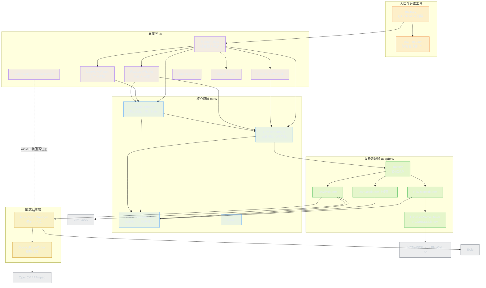

# 一、架构总览

## 1.1 定位

WeViewCam 是一个 **PyQt5 桌面客户端**形态的视频管理平台（VMS Client），运行在 Ubuntu Linux x86_64，通过三套协议栈对接前端设备：

- **海康 HCNetSDK**：`ctypes` 直接绑定官方 Linux 64 位动态库，走 SDK 私有协议，原生硬解直绘 X11 窗口；
- **ONVIF / RTSP**：`onvif-zeep` 做设备发现与取流地址协商，LibVLC / OpenCV 双引擎播放；
- **大华 NetSDK**：当前为骨架实现，预留接入位。

整体是**四层 + 一条旁路**：界面层 → 核心域层 → 设备适配层 → 厂商 SDK/播放引擎，旁路是"窗口表面回调注册表"（让软解引擎把帧送进 Qt 控件）。

## 1.2 分层结构

## 1.3 每层的职责与边界

| 层 | 目录 | 职责 | 明确不做的事 |
| --- | --- | --- | --- |
| 入口 | `main.py`、`scan_rtsp.py` | 进程引导、日志初始化、环境自检；独立的设备探测诊断工具 | 不包含业务逻辑，不直接触碰适配器 |
| 界面 | `ui/` | 控件树构建、用户交互、状态可视化、对话框编排 | 不实现协议细节、不解析 SDK 返回码、不拼接 RTSP 路径 |
| 核心域 | `core/` | 领域模型（设备/通道/录像片段）、设备注册与持久化、视口状态机与句柄调度、统一日志 | 不 import 任何具体厂商 adapter（仅通过工厂函数）、不依赖 Qt 控件 |
| 设备适配 | `adapters/` | 把统一契约翻译成厂商 SDK 调用；协议握手、取流、PTZ、检索、回放 | 不感知 UI 与槽位概念、不管理设备持久化 |
| 播放引擎 | `adapters/onvif/player.py` | RTSP 会话句柄、引擎降级、抓图/录像、URL 脱敏 | 不关心是谁调用的（ONVIF 设备与回放共用同一管理器） |

## 1.4 关键设计决策

**D1 · 用抽象基类收敛全部厂商差异**
`BaseDeviceAdapter` 定义 17 个抽象方法 + 2 个可覆写钩子（登录、通道、实时预览、抓图、录像、PTZ、检索、回放、下载、窗口刷新）。上层只依赖这个契约，新增厂商 = 新增一个子类 + 在 `factory` 加一个分支。代价是接口偏大，任何厂商都要实现全部方法（大华因此写了 109 行空实现）。

**D2 · 三级降级保证"任何环境都能启动"**
真实 SDK → 其他可用引擎 → 模拟模式。海康链路上，Linux 且有 `libhcnetsdk.so` 才走真实调用，否则 `is_available=False`，所有方法返回编造的句柄与数据；ONVIF 链路上 `onvif-zeep` 缺失或端口全失败也进入模拟。播放链路上 LibVLC 不可用则退 OpenCV，两者都不可用则 mock。
**收益**：Windows 开发机、无 VLC 的纯净 Ubuntu 都能跑通全流程。**代价**：见 [RISK-04](06-issues-and-roadmap.md)，ONVIF 登录失败仍返回 `True`，调用方无法区分"真连上"与"演示模式"。

**D3 · 句柄即会话，UI 从不持有 SDK 对象**
所有播放/回放会话被抽象成 `int` 句柄：海康来自 `NET_DVR_RealPlay_V40` / `NET_DVR_PlayBackByTime_V40`，ONVIF 来自 `RtspPlayerManager` 的自增计数器（起 6100），大华用 `5100+ch` / `5200+ch` 编造。`PlayerController` 把「槽位 → 句柄」的映射集中在一处（`SlotState`），UI 只说"槽位 3 播放通道 1"。
**收益**：UI 与 SDK 生命周期彻底解耦，替换厂商不影响界面代码。**代价**：句柄是裸 `int`，没有类型隔离，误传不会报错（见 [BUG-01](06-issues-and-roadmap.md)）。

**D4 · 原生窗口句柄直传实现零拷贝硬解**
`VideoSurface` 打开 `Qt.WA_NativeWindow`，把 `winId()`（X11 Window ID）交给 SDK：海康写入 `NET_DVR_PREVIEWINFO.hPlayWnd`，VLC 调用 `set_xwindow()`。硬解帧由驱动直接绘制到该窗口，CPU 占用极低。
**旁路**：软解引擎（OpenCV）拿不到窗口，因此引入 `RtspPlayerManager._WIN_SURFACE_REGISTRY`——控件注册「winId → QImage 回调」，解码线程逐帧回调 `VideoSurface.update_frame()`，再由 `paintEvent` 按等比缩放绘制。这是图谱中标注为 `registers_callback` 的那条边。

**D5 · 用延迟导入化解分层方向冲突**
`core/device_manager.py` 需要在创建设备时调用 `adapters/factory.py`，但 `adapters/*` 又依赖 `core/base_adapter.py`。做法是把 `from adapters.factory import ...` 写在方法体内（运行期导入），于是模块级依赖保持单向，**全仓库不存在模块级循环依赖**（分析见 [03-dependency-map.md](03-dependency-map.md)）。`main.py` 对 `ui.main_window` 同样采用函数内导入，避免启动期加载全部 Qt 重依赖。

**D6 · 单一事实来源**
版本号只有 `core/__init__.py:__version__` 一处；设备配置只有 `config/devices.json` 一处；日志只有 `core/logger.py` 一处。UI、打包脚本、日志横幅都从这里取值。

**D7 · UI 内部用 Qt 信号槽解耦**
控件只发信号不持有兄弟控件引用：`VideoWidget` 发 6 个信号，`DeviceTreeWidget` 发 4 个，`TimelineBar` 发 1 个，全部由父级（`LiveViewWidget` / `MainWindow` / `PlaybackWidget`）连接。完整信号总线见 [05-domain-model.md](05-domain-model.md)。

## 1.5 现实偏差（设计意图 vs 代码现状）

图谱用 `edges` 记录了下列"跨层直接依赖"，它们是架构上的技术债，不是崩溃点：

| 位置 | 偏差 | 影响 |
| --- | --- | --- |
| `ui/main_window.py:20` | 界面层直接 import 具体驱动 `adapters.hikvision.driver` | 仅为读 `is_loaded` 显示徽标、退出时 `cleanup()`；换厂商时此处需改 |
| `ui/video_widget.py:40,186` | 界面层直接 import 播放引擎 `adapters.onvif.player` | 软渲染回调注册必须知道 winId 与引擎，缺少中间抽象 |
| `ui/playback_widget.py:265` | 绕过 `PlayerController` 直接调用 `adapter.find_records()` | 检索不经门面，状态与错误处理不统一，且在 UI 线程同步阻塞（RISK-07） |
| `ui/playback_widget.py:20` | 从 `device_tree_widget` 导入图标工具函数 | 图标工具函数放在控件模块里，复用方向不自然 |
| `core/device_manager.py:34` | 函数体内导入 `adapters.factory` | 有意为之（D5），但静态分析工具会报"隐藏依赖" |

## 1.6 组件速查

| 组件 | 行数 | 关键方法 | 图谱节点 |
| --- | --- | --- | --- |
| `PlayerController` | 409 | `start_live_play` / `start_playback` / `stop_slot` / `reopen_live_play` / `reopen_playback` | `cls:core/player_controller.py#PlayerController` |
| `DeviceManager` | 244 | `add_device` / `connect_device` / `test_connection` / `save_devices` / `load_devices` | `cls:core/device_manager.py#DeviceManager` |
| `HikvisionNativeDriver` | 1019 | `login` / `get_channels` / `ptz_control` / `find_records` / `refresh_play` | `cls:adapters/hikvision/driver.py#HikvisionNativeDriver` |
| `OnvifAdapter` | 519 | `login` / `get_stream_uri_candidates` / `_normalize_rtsp_url` / `ptz_control` | `cls:adapters/onvif/adapter.py#OnvifAdapter` |
| `RtspPlayerManager` | 443 | `start_play` / `stop_play` / `capture_picture` / `register_window_surface` | `cls:adapters/onvif/player.py#RtspPlayerManager` |
| `LiveViewWidget` | 440 | `switch_layout` / `play_channel_in_slot` / `_reopen_slot_if_playing` | `cls:ui/live_view_widget.py#LiveViewWidget` |
| `PlaybackWidget` | 430 | `search_records` / `start_playback_at` / `_toggle_play_pause` | `cls:ui/playback_widget.py#PlaybackWidget` |
| `TimelineBar` | 239 | `set_records` / `set_zoom_duration` / `paintEvent` / `wheelEvent` | `cls:ui/timeline_bar.py#TimelineBar` |

> 完整清单（26 个类 + 25 个顶层函数，含逐方法行号）见 [02-module-index.md](02-module-index.md)。
