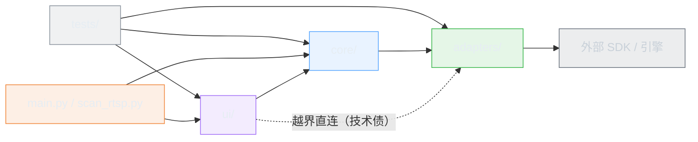

# 三、依赖关系图

## 3.1 模块依赖矩阵

只列**仓库内**依赖（`✓` = 模块顶层导入，`↯` = 函数体内延迟导入）。第三方依赖见 3.3。

| 导入方 ↓ \ 被导入 → | core/base_adapter | core/device_manager | core/player_controller | core/logger | core/`__init__` | adapters/factory | hik/adapter | hik/driver | hik/structures | dahua/adapter | onvif/adapter | onvif/player | ui/* |
| --- | :-: | :-: | :-: | :-: | :-: | :-: | :-: | :-: | :-: | :-: | :-: | :-: | :-: |
| `main.py` | | | | ✓ | ✓ | | | | | | | | ↯ main_window |
| `scan_rtsp.py` | | | | | | | | | | | | | |
| `core/device_manager.py` | ✓ | | | ✓ | | ↯ | | | | | | | |
| `core/player_controller.py` | ✓ | ✓ | | ✓ | | | | | | | | | |
| `adapters/factory.py` | ✓ | | | ✓ | | | ✓ | | | ✓ | ✓ | | |
| `adapters/hikvision/adapter.py` | ✓ | | | ✓ | | | | ✓ | | | | | |
| `adapters/hikvision/driver.py` | ✓ | | | ✓ | | | | | ✓ | | | | |
| `adapters/dahua/adapter.py` | ✓ | | | ✓ | | | | | | | | | |
| `adapters/onvif/adapter.py` | ✓ | | | ✓ | | | | | | | | ✓ | |
| `adapters/onvif/player.py` | | | | ✓ | | | | | | | | | |
| `ui/timeline_bar.py` | ✓ | | | | | | | | | | | | |
| `ui/device_tree_widget.py` | ✓ | ✓ | | | | | | | | | | | |
| `ui/device_dialog.py` | ✓ | ✓ | | | | | | | | | | | |
| `ui/video_widget.py` | | | | | | | | | | | | ↯ | |
| `ui/live_view_widget.py` | ✓ | | ✓ | | | | | | | | | | ✓ video_widget |
| `ui/playback_widget.py` | ✓ | ✓ | ✓ | | | | | | | | | | ✓ video_widget, timeline_bar, device_tree_widget |
| `ui/main_window.py` | | ✓ | ✓ | ✓ | ✓ | | | ✓ | | | | | ✓ 5 个 ui 模块 |
| `tests/test_adapters.py` | ✓ | ↯ | ↯ | | | ✓ | ✓ | | | ✓ | ✓ | | |
| `tests/test_device_manager.py` | ✓ | ✓ | | | | | | | | | | | ↯ device_dialog |
| `tests/test_onvif.py` | ✓ | | | | | | | | | | ✓ | ✓ | |
| `tests/test_timeline.py` | ✓ | | | | | | | | | | | | |

**结论一：全仓库无模块级循环依赖。** 即使把延迟导入 `↯` 也算作普通边，`core/device_manager.py → adapters/factory.py → adapters/*` 这条路径也不会回到 `core/device_manager.py`，整个模块图是有向无环图（DAG）。分层单调：`tests / main` → `ui` → `core` → `adapters` → 外部。

**结论二：仅两处跨层直连。** `ui/main_window.py → adapters/hikvision/driver.py` 与 `ui/video_widget.py ↯ adapters/onvif/player.py`。前者只为读 SDK 加载状态和退出清理，后者是软渲染回调注册的必要耦合；两者都在 [01-architecture.md §1.5](01-architecture.md) 记录为技术债。

**结论三：`core/base_adapter.py` 是绝对的地基**，被 **16 个模块**依赖（`grep -c "from core.base_adapter import"` 覆盖 `core/device_manager.py`、`core/player_controller.py`、`adapters/factory.py`、三个厂商适配器、`adapters/hikvision/driver.py`、5 个 ui 模块与全部 4 个测试文件），而它自己零项目内依赖（仅 stdlib）。修改该文件的影响面等于全仓库——`knowledge-graph.json` 中 `cls:core/base_adapter.py#BaseDeviceAdapter` 的入边可以精确量化这个风险。

## 3.2 依赖方向与"应该 vs 实际"



## 3.3 外部依赖与降级行为

这套代码的显著特征是**每个外部依赖都有一个"优雅消失"的分支**，这是它能在多种环境下启动的原因，同时也是问题排查时最大的干扰源。

| 依赖 | 声明位置 | 缺失/失败时的行为 | 代码位置 |
| --- | --- | --- | --- |
| `PyQt5` | requirements | 硬依赖，缺失直接无法启动 | 全局 |
| `onvif-zeep` | requirements | `_HAS_ONVIF_SDK=False`，`login()` 直接置 `_is_logged_in=True` 返回成功；通道固定返回 1 个；PTZ 只打 debug 日志 | `adapters/onvif/adapter.py:28-32, 55-58, 212-214` |
| `python-vlc` | requirements | 导入抛 `ImportError/OSError` → `_HAS_VLC=False`，所有播放降级到 OpenCV | `adapters/onvif/player.py:22-26` |
| `libvlc` 运行时 | 系统包 | 同上；`vlc.Instance()` 失败也会把 `_has_vlc` 置回 False | `adapters/onvif/player.py:247-262` |
| `opencv-python-headless` | requirements | `_HAS_CV2=False` → 播放直接进 mock 模式；`scan_rtsp.py` 跳过真实拉流验证 | `player.py:29-34`；`scan_rtsp.py:17-22` |
| `numpy` | cv2 传递依赖 | 抓图占位图生成失败 → 退化为写出 `SNAPSHOT_PLACEHOLDER` 文本文件 | `player.py:157-168` |
| `libhcnetsdk.so` | 仓库自带 SDK 包 | `is_loaded=False` → 海康全链路模拟：登录返回 `1001`、通道返回 4 个假通道、预览返回 `2000+ch`、录像返回 4 段假片段 | `driver.py:103-108`；`driver.py:196-199, 236-243, 366-368, 567-598` |
| `libPlayCtrl.so` | 同上 | 窗口分辨率刷新退化为 `NET_DVR_ChangeWndResolution` / `NET_DVR_RefreshPlay` | `driver.py:944-960` |
| `libcrypto.so.3`、`libssl.so.3`、`libhpr.so`、`libHCCore.so` | 同上 | 预加载失败仅记 `debug` 日志，继续加载主库（失败原因容易被淹没） | `driver.py:119-129` |
| X11 / Qt xcb 平台插件 | 系统 | `run.sh` 强制 `QT_QPA_PLATFORM=xcb` 并 unset `QT_PLUGIN_PATH`；无 X11 时 `winId` 无意义，硬解无法嵌入 | `run.sh:42-47` |
| `FFmpeg`（经 OpenCV） | 系统/内置 | 通过 `OPENCV_FFMPEG_CAPTURE_OPTIONS` 强制 `rtsp_transport=tcp` 与 2s 超时 | `player.py:59`；`scan_rtsp.py:154` |
| `pytest` | requirements | 仅测试期 | `tests/` |

> 本机实测环境（用作参考）：`PyQt5 ✓ cv2 ✓ vlc ✓ numpy ✓ pytest ✓`，**`onvif-zeep ✗`** → 该环境下 ONVIF 设备实际走的是模拟分支，任何"ONVIF 测试通过"都不代表协议栈已验证。

## 3.4 依赖关系的机器化查询

依赖不是文档里的静态表格，而是图谱里可查询的事实：

```python
import json
g = json.load(open("docs/knowledge-graph/knowledge-graph.json", encoding="utf-8"))

# 1) 改动 core/base_adapter.py 的爆炸半径
[i["name"] for e in g["edges"] if e["to"] == "mod:core/base_adapter.py"
 for i in g["nodes"] if i["id"] == e["from"]]

# 2) 全部延迟导入（隐藏依赖）
[(e["from"], e["to"]) for e in g["edges"] if e["type"] == "imports_lazy"]

# 3) 跨层直连（ui -> adapters）
[e for e in g["edges"] if e["from"].startswith("mod:ui/") and e["to"].startswith("mod:adapters/")]

# 4) 外部依赖被谁使用
[(e["from"], e["to"]) for e in g["edges"] if e["to"].startswith("ext:")]
```

在 CI 中可以据此加闸门，例如「不允许新增 `ui/ → adapters/` 的直连」「新增外部依赖必须同时提供降级分支」。
