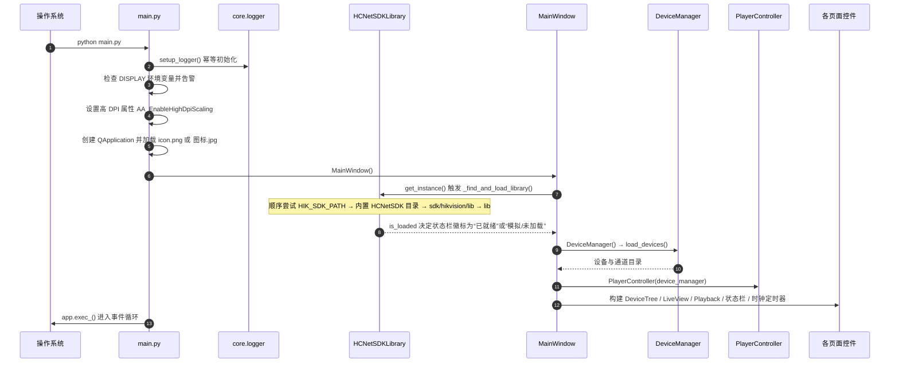
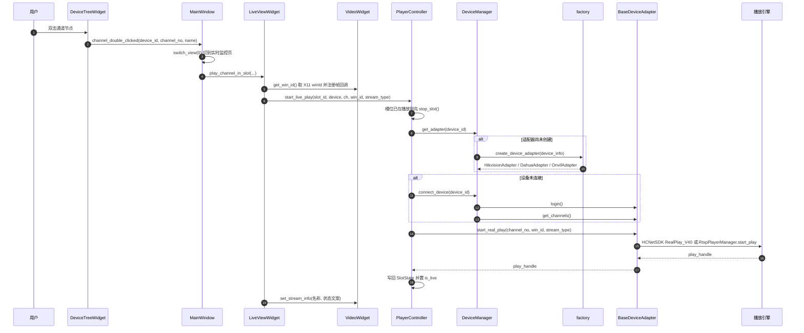
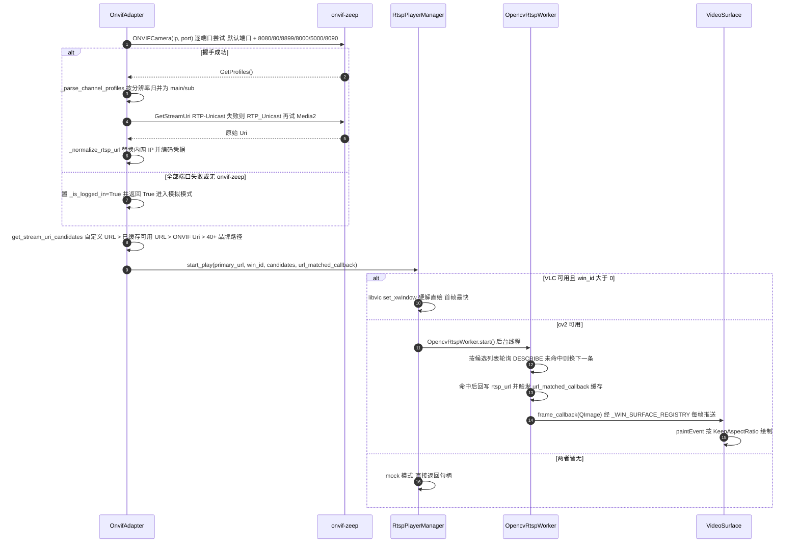
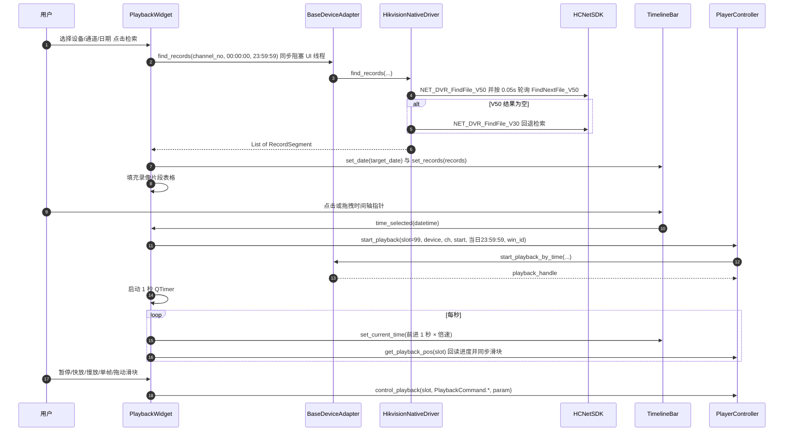
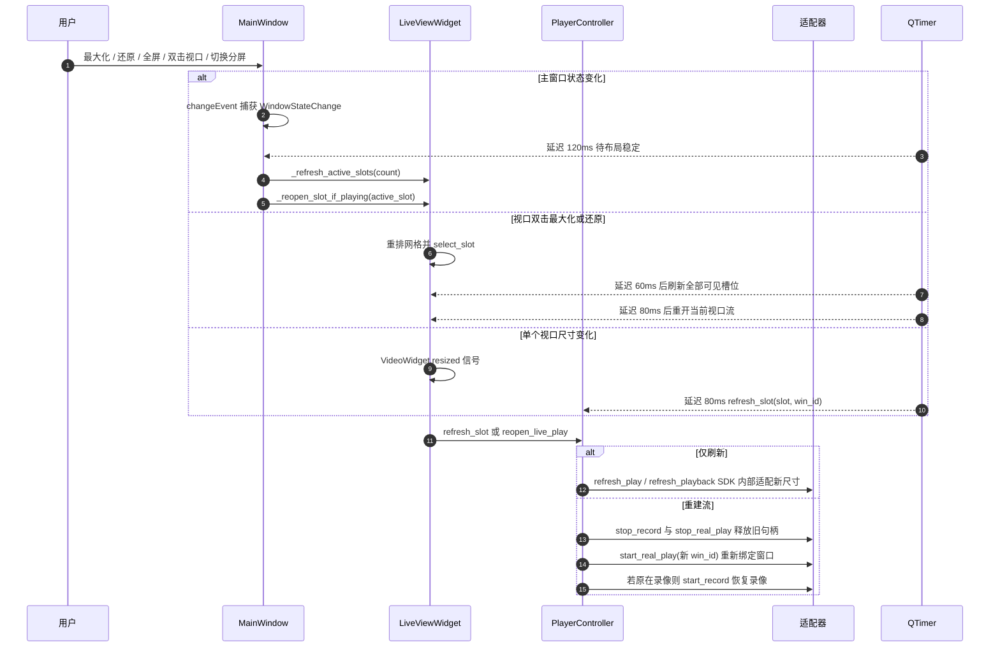

# 四、关键运行时流程

图谱 `flows` 字段固化了 5 条主链路。下面给出时序细节与代码定位；括号内为 `文件:行号`，可用 [02-module-index.md](02-module-index.md) 交叉核对。

---

## 4.1 FLOW-BOOT · 应用启动

**要点**

- SDK 加载发生在 `MainWindow.__init__` 里（`ui/main_window.py:103`），**不是**在首次连接设备时；因此启动横幅一出，SDK 的成败就已确定。
- `main.py` 对 `ui.main_window` 采用函数内导入（`main.py:51`），把 Qt 全量加载推迟到 `QApplication` 建立之后。
- 启动期唯一可能抛错而不被吞掉的是 `DeviceManager.load_devices()` 之外的部分；配置解析异常被 `try/except` 捕获并仅记录日志（`core/device_manager.py:243`）。

---

## 4.2 FLOW-LIVE · 双击通道开启实时预览

**要点**

- 播放前有两道自动补全：**适配器懒创建**（`core/device_manager.py:101-104`）与**登录懒补**（`core/player_controller.py:80-83`），因此用户不必先点"连接设备"。
- 切换槽位内容时先 `stop_slot()` 释放旧句柄（`core/player_controller.py:69-70`），避免句柄泄漏。
- `win_id` 由 `VideoWidget.get_win_id()` 提供，取的是内层 `VideoSurface` 的原生窗口，而不是外层 `QFrame`——这决定了硬解画面是否被 OSD 遮挡。

---

## 4.3 FLOW-ONVIF · ONVIF 取流协商（本项目最复杂的一条链路）

**要点**

- **路径候选是核心设计**：很多国产道闸/车牌一体机不响应标准 ONVIF，`get_stream_uri_candidates()`（`adapters/onvif/adapter.py:279-402`）把臻识/华夏智信/芊熠/大华/海康/雄迈/宇视/天地伟业等 40 余条路径按优先级排好，首次命中后写入 `_cached_working_urls`，后续直接复用（这是 [RISK-12](06-issues-and-roadmap.md) 的优化点：候选多且串行尝试）。
- **软渲染回调是唯一旁路**：`VideoSurface.__init__` 即注册（`ui/video_widget.py:39-43`），`get_win_id()` 时再注册一次；解码线程通过 `_WIN_SURFACE_REGISTRY` 回调把 `QImage` 送进 Qt。注册从未注销，见 [BUG-03](06-issues-and-roadmap.md)。
- **日志脱敏**：URL 中的口令统一经 `RtspPlayerManager._mask_url()` 处理后再落日志（`adapters/onvif/player.py:431-443`），但真实 URL 仍以明文存在于内存与 SDK 调用中。

---

## 4.4 FLOW-PLAYBACK · 录像检索与 24 小时时间轴回放

**要点**

- 回放使用**专用槽位 `slot_id = 99`**（`ui/playback_widget.py:31`），与实时监控的 0–15 号槽位完全隔离，二者可同时播放。
- 检索是**同步调用且在 UI 线程**（`ui/playback_widget.py:265`），驱动层最长会轮询 100×0.05s；弱网设备上界面会卡住（[RISK-07](06-issues-and-roadmap.md)）。
- 进度采用**双源**：UI 定时器自行按倍速推进指针（保证画面流畅），同时每秒向 SDK 回读真实进度覆盖滑块（保证最终一致）。
- 时间轴缩放窗口化 24h → 12h → 4h → 1h（`set_zoom_duration`），滚轮缩放以鼠标位置为锚点。

---

## 4.5 FLOW-RESIZE · 窗口缩放 / 最大化后的重开流

这是本项目特有的补偿机制：X11 硬解窗口在父控件尺寸剧变后不会自动重排，需要显式通知甚至重建流。

**要点**

- 三级延迟（60 / 80 / 120 ms）是刻意的时间预算：先等 Qt 完成布局，再通知 SDK 刷新，最后才对需要重建的视口重开流。
- `reopen_live_play()`（`core/player_controller.py:296-355`）会**自动恢复原本进行中的本地录像**，这是它在实现上最容易被忽略的部分。
- `reopen_playback()`（`core/player_controller.py:357-401`）存在**实参顺序缺陷**（[BUG-01](06-issues-and-roadmap.md)），该分支下的重开流在真实 SDK 上不可用；模拟模式下因为句柄是编造的所以测试看不出来。
- 视口销毁时软渲染回调未注销（[BUG-03](06-issues-and-roadmap.md)），长时间反复切换分屏会累积注册表条目。

---

## 4.6 五条流程在图谱中的位置

| 流程 id | 入口节点 | 涉及节点数 | 关键风险 |
| --- | --- | --- | --- |
| `FLOW-BOOT` | `fn:main.py#main` | 9 | RISK-11（Windows 下静默降级为模拟） |
| `FLOW-LIVE` | `cls:ui/device_tree_widget.py#DeviceTreeWidget` | 8 | BUG-02（PTZ 回退分支抛异常） |
| `FLOW-ONVIF` | `cls:adapters/onvif/adapter.py#OnvifAdapter` | 4 | RISK-04（失败仍报成功）、RISK-12（候选串行） |
| `FLOW-PLAYBACK` | `cls:ui/playback_widget.py#PlaybackWidget` | 5 | RISK-03（ONVIF 回放是假的）、RISK-07（UI 阻塞） |
| `FLOW-RESIZE` | `cls:ui/main_window.py#MainWindow` | 4 | BUG-01（回放重开流实参错位） |

在 `graph.html` 中直接搜索 `PlayerController` 或 `RtspPlayerManager`，可看到这些流程节点的高密度连边。
