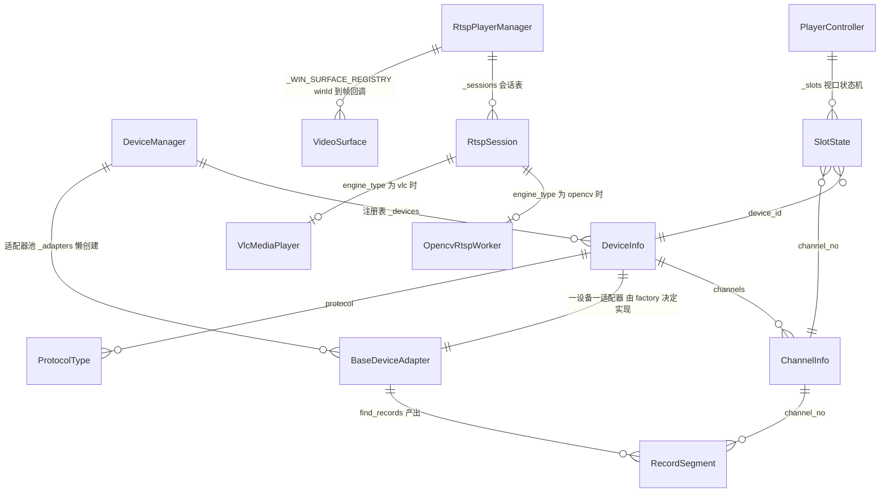
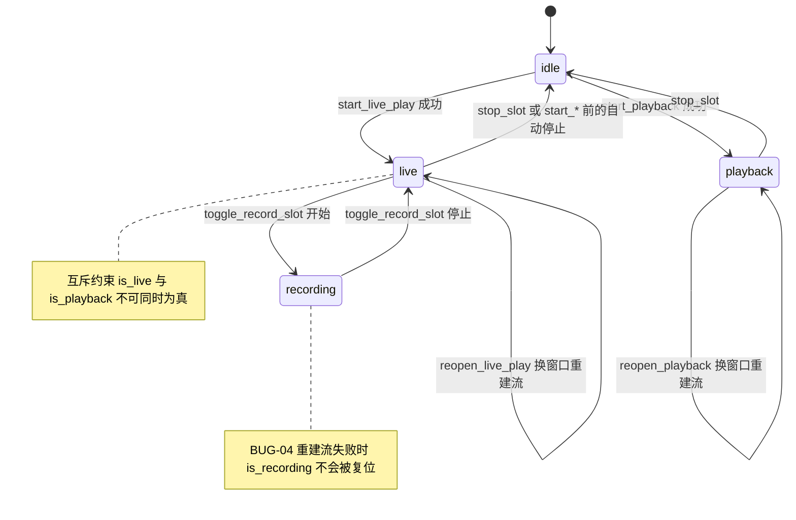

# 五、领域模型

## 5.1 实体关系



## 5.2 实体字段

| 实体 | 定义位置 | 字段 | 说明 |
| --- | --- | --- | --- |
| `DeviceInfo` | `core/base_adapter.py:60` | `device_id, name, ip, port=8000, username="admin", password="", protocol=HIKVISION, rtsp_port=554, channels=[], is_connected=False, extra={}` | 聚合根。`extra` 是一个开放字典，当前全仓库**只实际消费一个键**：`custom_rtsp_url`（自定义取流路径，`adapters/onvif/adapter.py:288`）；RTSP 端口不放在 `extra` 里，而是用专门的 `rtsp_port` 字段（`adapters/onvif/adapter.py:294`） |
| `ChannelInfo` | `core/base_adapter.py:50` | `channel_no, name, is_online=True, is_ptz=False, device_id="", extra={}` | 通道即"某设备上的一路视频" |
| `RecordSegment` | `core/base_adapter.py:75` | `channel_no, start_time, end_time, file_name="", file_size=0, record_type="schedule"` | 时间轴与片段列表的数据单元；`record_type` 已定义 schedule/alarm/manual/motion 但当前实现恒为默认值 |
| `SlotState` | `core/player_controller.py:22` | `slot_id, win_id, device_id, channel_no, channel_name, is_live, is_playback, is_recording, play_handle=-1, playback_handle=-1, record_path, stream_type, start_time, end_time` | 一个视口的完整会话状态 |
| `RtspSession` | `adapters/onvif/player.py:195` | `handle, rtsp_url, candidate_urls, url_matched_callback, win_id, is_playing, is_recording, record_path, engine_type, vlc_player, vlc_media, opencv_worker` | RTSP 播放会话；`engine_type` ∈ {vlc, opencv, mock} |

三个枚举：`ProtocolType`（hikvision / dahua / onvif / custom_rtsp）、`PTZCommand`（14 项）、`PlaybackCommand`（9 项）。它们是与厂商无关的**公共词汇表**——上层只用这些枚举表达意图，由适配器翻译成 SDK 常量（如 `PTZCommand.UP → TILT_UP = 21`）。

## 5.3 视口状态机



**状态不变量**（代码实际维持的程度）：

| 不变量 | 是否成立 | 依据 |
| --- | --- | --- |
| `is_live` 与 `is_playback` 互斥 | ✅ 成立 | `start_live_play` 先 `stop_slot()` 再置位（`core/player_controller.py:69-70, 101-102`） |
| `play_handle >= 0` ⟺ `is_live` | ✅ 成立 | 失败时提前 return，不写状态 |
| `is_recording` 为真 ⟹ 本地录像正在写入 | ⚠️ 重建流失败时会破坏 | [BUG-04](06-issues-and-roadmap.md) |
| 一个 `device_id` 至多一个适配器实例 | ✅ 成立 | `_adapters` 字典 + `get_adapter` 懒创建判重 |
| `ChannelInfo.device_id` 等于其父设备 id | ✅ 成立 | 落盘时强制写入父 id（`core/device_manager.py:183`），海康链路额外回填（`adapters/hikvision/adapter.py:69-70`） |
| 视口的 `channel_no > 0` 才能下发 PTZ | ✅ 成立 | `ptz_control` 前置校验（`core/player_controller.py:262`） |

## 5.4 Qt 信号总线

界面层只用信号通信，下面是完整的连线清单（连接点行号可直接跳转）。

| 发出者 | 信号 | 载荷 | 接收者 | 槽 | 连接点 |
| --- | --- | --- | --- | --- | --- |
| `VideoWidget` | `clicked` | `slot_id` | `LiveViewWidget` | `_on_slot_clicked` | `ui/live_view_widget.py:125` |
| `VideoWidget` | `double_clicked` | `slot_id` | `LiveViewWidget` | `_on_slot_double_clicked` | `ui/live_view_widget.py:126` |
| `VideoWidget` | `close_requested` | `slot_id` | `LiveViewWidget` | `_on_slot_close_requested` | `ui/live_view_widget.py:127` |
| `VideoWidget` | `capture_requested` | `slot_id, save_path` | `LiveViewWidget` | `_on_slot_capture` | `ui/live_view_widget.py:128` |
| `VideoWidget` | `record_toggle_requested` | `slot_id` | `LiveViewWidget` | `_on_slot_record_toggle` | `ui/live_view_widget.py:129` |
| `VideoWidget` | `resized` | `slot_id` | `LiveViewWidget` | `_on_slot_resized` | `ui/live_view_widget.py:130` |
| `VideoWidget` | `double_clicked` | `slot_id` | `PlaybackWidget` | `_toggle_fullscreen_playback` | `ui/playback_widget.py:114` |
| `VideoWidget` | `resized` | `slot_id` | `PlaybackWidget` | lambda → `refresh_slot` | `ui/playback_widget.py:115` |
| `DeviceTreeWidget` | `channel_double_clicked` | `device_id, channel_no, name` | `MainWindow` | `_on_channel_double_clicked` | `ui/main_window.py:134` |
| `DeviceTreeWidget` | `add_device_requested` | — | `MainWindow` | `_show_add_device_dialog` | `ui/main_window.py:135` |
| `DeviceTreeWidget` | `edit_device_requested` | `device_id` | `MainWindow` | `_show_edit_device_dialog` | `ui/main_window.py:136` |
| `DeviceTreeWidget` | `delete_device_requested` | `device_id` | `MainWindow` | `_on_delete_device` | `ui/main_window.py:137` |
| `TimelineBar` | `time_selected` | `datetime` | `PlaybackWidget` | `_on_timeline_time_selected` | `ui/playback_widget.py:143` |
| `QPushButton`（PTZ 8 向 + 6 光学） | `pressed` / `released` | — | `LiveViewWidget` | `_send_ptz_command(stop=False/True)` | `ui/live_view_widget.py:247-248` |
| `QSlider`（速度 1–7） | `valueChanged` | `int` | `LiveViewWidget` | 更新速度标签 | `ui/live_view_widget.py:232` |
| `QTimer`（回放 1s） | `timeout` | — | `PlaybackWidget` | `_on_timer_tick` | `ui/playback_widget.py:214` |
| `QTimer`（主时钟 1s） | `timeout` | — | `MainWindow` | `_update_clock` | `ui/main_window.py:164` |

**非 Qt 的"回调总线"**：`RtspPlayerManager._WIN_SURFACE_REGISTRY`（类级字典 `winId → Callable[[QImage], None]`）承担软渲染帧派发；`OpencvRtspWorker` 另有一个 `url_matched_callback` 把首次命中的 RTSP 路径回写给 `OnvifAdapter` 缓存。

## 5.5 句柄生命周期

句柄是这套系统里跨层的"会话凭据"，全部以裸 `int` 传递。理解取值范围就能快速判断设备是否处于模拟模式。

| 句柄种类 | 生产者 | 释放方式 | 模拟模式取值 |
| --- | --- | --- | --- |
| 海康登录 `user_id` | `NET_DVR_Login_V30`（`driver.py:206`） | `NET_DVR_Logout`（`driver.py:229`） | `1001`（`driver.py:199`） |
| 海康实时预览 | `NET_DVR_RealPlay_V40`（`driver.py:377`） | `NET_DVR_StopRealPlay`（`driver.py:398`） | `2000 + channel_no`（`driver.py:368`） |
| 海康按时间回放 | `NET_DVR_PlayBackByTime_V40`（`driver.py:811`） | `NET_DVR_StopPlayBack`（`driver.py:923`） | `3000 + channel_no`（`driver.py:790`） |
| 海康按文件名回放 | `NET_DVR_PlayBackByName`（`driver.py:841`） | 同上 | `4001`（`driver.py:839`） |
| RTSP 播放会话 | `RtspPlayerManager._next_handle`，起 `6100` 自增（`player.py:243, 280-281`） | `stop_play`（`player.py:353`） | 同样分配（mock 分支也入表） |
| 大华登录 | 常量 `5001`（`dahua/adapter.py:34`） | 置 `-1` | 恒为 `5001` |
| 大华实时预览 / 回放 | `5100+ch` / `5200+ch`（`dahua/adapter.py:53, 89`） | 空操作 | 同上 |

推断口诀：`1001` 段=海康模拟，`2000/3000/4001` 段=海康模拟预览/回放，`5001/5100/5200` 段=大华骨架，`6100+`=RTSP 真实引擎句柄（可能仍是 mock 分支分配）。

## 5.6 持久化格式

`config/devices.json` 是设备配置的唯一落盘位置，结构为**对象数组**：

```jsonc
[
  {
    "device_id": "hik_demo_01",
    "name": "海康威视演示设备",
    "ip": "192.168.1.64", "port": 8000,
    "username": "admin", "password": "",        // ← 明文（RISK-01）
    "protocol": "hikvision",                     // ProtocolType.value
    "rtsp_port": 554,
    "channels": [
      { "channel_no": 1, "name": "通道 1 - 主大门球机",
        "is_online": true, "is_ptz": true,
        "device_id": "hik_demo_01",              // 落盘时强制为父设备 id
        "extra": {} }
    ],
    "extra": {}                                  // custom_rtsp_url 等
  }
]
```

**不落盘的运行时状态**：`is_connected`（每次启动重置为 `false`，`core/device_manager.py:237`）、所有句柄、槽位状态、RTSP 缓存。这解释了"重启后设备列表还在，但需要重新连接"的行为。

**写入时机**：`add_device`（含自动连接后回写通道）、`update_device`（先 logout 再重建适配器）、`remove_device`、`connect_device` 成功后。`test_connection` 用临时适配器，**不写盘**。

## 5.7 领域词汇表（中英对照，便于读代码）

| 代码词汇 | 中文 | 说明 |
| --- | --- | --- |
| Adapter | 适配器 | 厂商协议实现，`BaseDeviceAdapter` 子类 |
| Channel | 通道 | 设备上的一路视频 |
| Slot / Viewport | 槽位 / 视口 | 界面上的一个视频窗口，`slot_id` 0–15 为实时，99 为回放专用 |
| Handle | 句柄 | 会话凭据（int） |
| Real Play | 实时预览 | SDK 的 RealPlay 系列 |
| Playback / VOD | 回放 | 按时间或按文件名 |
| Record Segment | 录像片段 | 检索结果单元 |
| Stream Type | 码流类型 | 0=主码流（高清），1=子码流（流畅） |
| PTZ | 云台 | 8 方向 + 变焦/聚焦/光圈 |
| Capture | 抓图 | 单帧截图，JPEG |
| Refresh / Reopen | 刷新 / 重开流 | 窗口尺寸变化后的两级补偿 |
| Mock / Simulated | 模拟模式 | 无 SDK 时的降级运行 |
